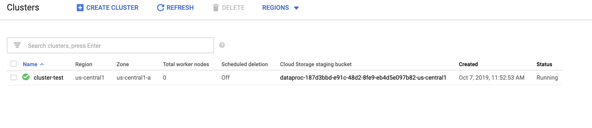
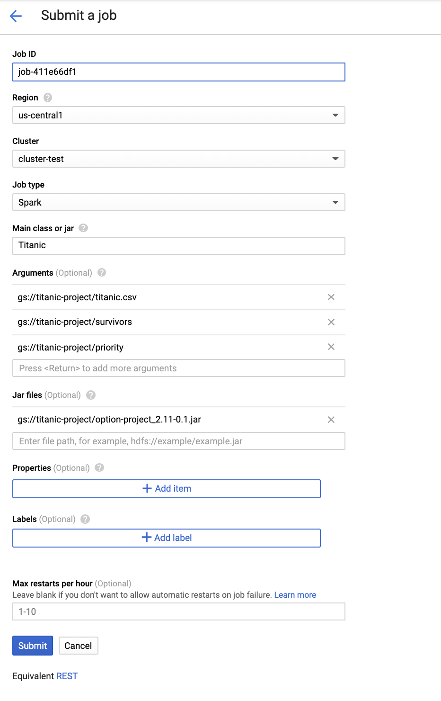
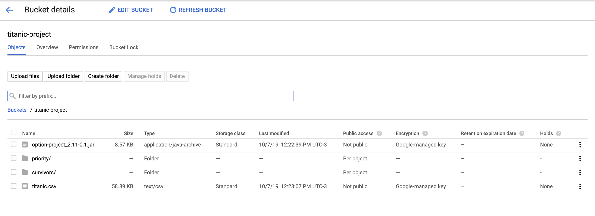
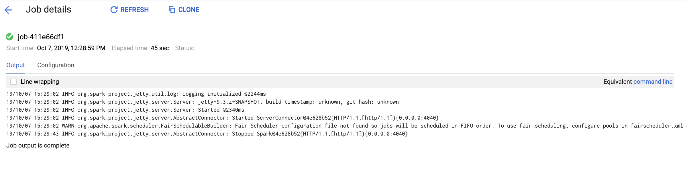
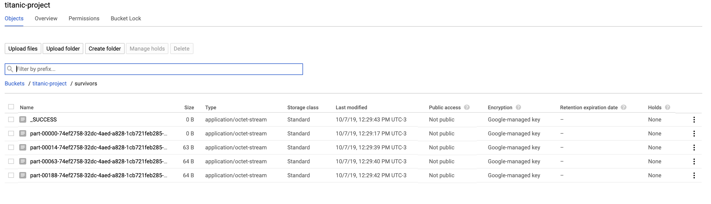
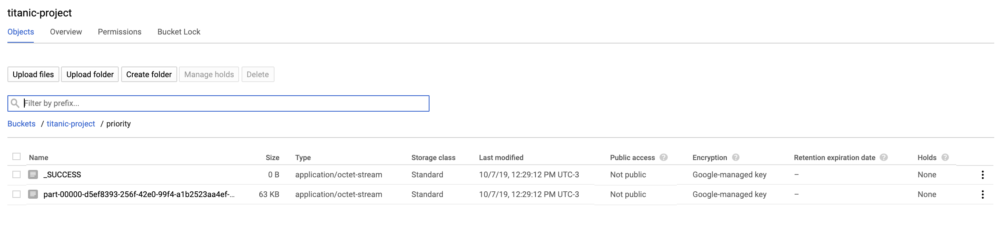

## Titanic Project

### Stack tecnológico
* Sbt
* Scala 2.11.12
* Spark 2.4.3


### Run

```
sbt package
```
```
spark-submit --class Titanic --name Titanic --packages org.apache.spark:spark-sql-kafka-0-10_2.11:2.4.3 /target/scala-2.11/option-project_2.11-0.1.jar
```


### Ejecutar en GCP
## Crear cluster en DataProc

## Crear un job en DataProc


## Crear un bucket y subir archivos


## Finalmente, job exitoso


## El CSV que incluye la info de la tabla de información de sobrevivientes por tipo de clase se almacenaron en Storage /survivors


## El CSV que incluye la información de las distintas prioridades se almacenaron en  Storage /priority

